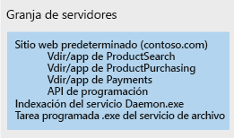
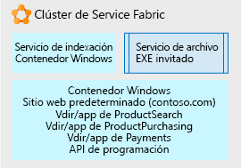

# Uso de Service Fabric para descomponer aplicaciones monolíticas

En este escenario de ejemplo, analizaremos un enfoque que utiliza [Service Fabric](/azure/service-fabric/service-fabric-overview) como una plataforma para descomponer una aplicación monolítica difícil de manejar. Se considera un enfoque iterativo para descomponer un sitio web de IIS/ASP.NET en una aplicación formada por varios microservicios fáciles de administrar.

El cambio de una arquitectura monolítica a una arquitectura de microservicios ofrece las siguientes ventajas:
* Puede cambiar una unidad pequeña y comprensible de código e implementar solo dicha unidad.
* Cada unidad de código requiere solo unos pocos minutos o menos para su implementación.
* Si se produce un error en esa unidad pequeña, solo esa unidad deja de funcionar, no toda la aplicación.
* Las unidades pequeñas de código se pueden distribuir de forma discreta y fácil entre varios equipos de desarrollo.
* Los nuevos desarrolladores pueden entender rápida y fácilmente la funcionalidad discreta de cada unidad.

En este ejemplo se usa una aplicación de IIS grande en una granja de servidores, pero los conceptos de descomposición iterativa y de hospedaje se pueden usar para cualquier tipo de aplicación de gran tamaño. Aunque esta solución usa Windows, también se puede ejecutar Service Fabric en Linux. Se puede ejecutar de forma local, en Azure o en nodos de máquina virtual en el proveedor en la nube de su elección.

## Casos de uso pertinentes

Este escenario es apropiado para organizaciones con grandes aplicaciones web monolíticas que están experimentando:

- Errores en pequeños cambios de código que interrumpen todo el sitio web.
- La versiones tardan varios días debido a la necesidad de liberar la actualización todo el sitio web.
- Largos tiempos de preparación al incorporar nuevos desarrolladores o equipos debido al complejo código base, que requiere que un usuario individual conozca más de lo que es posible.

## Arquitectura

Mediante el uso de Service Fabric como plataforma de hospedaje podemos convertir un sitio web de IIS de gran tamaño en una colección de microservicios, como se muestra a continuación:

En la imagen anterior, se descomponen todas las partes de una aplicación de IIS de gran tamaño en:

- Un servicio de enrutamiento o de puerta de enlace que acepta las solicitudes entrantes del explorador, las analiza para determinar qué servicio debería procesarlas y reenvía la solicitud a ese servicio.
- Cuatro aplicaciones ASP.NET Core que eran anteriormente directorios virtuales de un único sitio IIS que se ejecutan como aplicaciones ASP.NET. Las aplicaciones se han separado en sus propios microservicios independientes. El efecto es que se pueden modificar, generar versiones y actualizar por separado. En este ejemplo, se ha vuelto a escribir cada aplicación con .Net Core y ASP.NET Core. Se han escrito como [Reliable Services](/azure/service-fabric/service-fabric-reliable-services-introduction) para que puedan acceder de forma nativa a las funcionalidades completas de la plataforma de Service Fabric y sus ventajas (servicios de comunicación, informes de mantenimiento, notificaciones, etc).
- Un servicio de Windows llamado *servicio de indexación*, situado en un contenedor Windows para que no haga más cambios directos en el registro del servidor subyacente, pero que se puede ejecutar de manera independiente y se implementa con todas sus dependencias como una única unidad.
- Un servicio de archivo, que es simplemente un archivo ejecutable que se ejecuta según una programación y realiza algunas tareas para los sitios. Se hospeda directamente como un ejecutable independiente porque se ha determinado que realiza su función sin modificaciones y no vale la pena invertir en su cambio.

## Consideraciones

El primer desafío consiste en empezar a identificar fragmentos de código más pequeños que se pueden extraer de la estructura monolítica para formar microservicios a los que esta puede llamar. De forma iterativa en el tiempo, la estructura monolítica se divide en una colección de estos microservicios que los desarrolladores pueden comprender fácilmente, cambiar e implementar rápidamente con un riesgo mínimo.

Se ha elegido Service Fabric porque es capaz de admitir la ejecución de todos los microservicios en sus diversas formas. Por ejemplo, puede tener una combinación de archivos ejecutables independientes, nuevos sitios web pequeños, nuevas API pequeñas, servicios en contenedores, etc. Service Fabric puede combinar todos estos tipos de servicio en un único clúster.

Para llegar a esta aplicación final descompuesta, se ha utilizado un enfoque iterativo. Partimos de un sitio web de IIS/ASP.NET grande en una granja de servidores. A continuación, se muestra un único nodo de la granja de servidores. Contiene el sitio web original con varios directorios virtuales, un servicio de Windows adicional al que el sitio llama y un archivo ejecutable que efectúa cierto mantenimiento de archivo del sitio de forma periódica.

En la primera iteración de desarrollo, el sitio de IIS y los directorios virtuales se colocan en un [contenedor Windows](/azure/service-fabric/service-fabric-containers-overview). Esto permite que el sitio permanezca operativo, pero no está enlazado estrechamente con el sistema operativo del nodo de servidor subyacente. El nodo de Service Fabric subyacente ejecuta y orquesta el contenedor, pero el nodo no necesita tener ningún estado de las dependencias del sitio (entradas del registro, archivos, etc). Todos estos elementos están en el contenedor. También hemos colocado el servicio de indexación en un contenedor Windows por las mismas razones. Los contenedores se pueden ser implementar, generar versiones y escalar de forma independiente. Por último, se hospeda el servicio de archivo como un [archivo ejecutable independiente](/azure/service-fabric/service-fabric-guest-executables-introduction) simple, ya que es un archivo .exe independiente sin requisitos especiales.

La siguiente imagen muestra cómo se descompone parcialmente el sitio web grande en unidades independientes listas para descomponerse más cuando el tiempo lo permita.

El desarrollo posterior se centra en separar el contenedor del sitio web predeterminado de gran tamaño descrito anteriormente. Cada una de las aplicaciones ASP.NET del directorio virtual se eliminan del contenedor de una en una y se migran a [Reliable Services](/azure/service-fabric/service-fabric-reliable-services-introduction) de ASP.NET Core.

Después de extraer cada uno de los directorios virtuales, el sitio web predeterminado se escribe como una instancia de Reliable Services de ASP.NET Core, que acepta solicitudes entrantes del explorador y las enruta a la aplicación ASP.NET correcta.

### Disponibilidad, escalabilidad y seguridad

Service Fabric es [capaz de admitir distintas formas de microservicios](/azure/service-fabric/service-fabric-choose-framework) manteniendo rápidas y sencillas las llamadas entre ellos en el mismo clúster. Service Fabric es un clúster de recuperación automática [tolerante a errores](/azure/service-fabric/service-fabric-availability-services) que puede ejecutar contenedores, archivos ejecutables e incluso tiene una API nativa para escribir los microservicios directamente (los "Reliable Services" mencionados anteriormente). La plataforma facilita las actualizaciones graduales y el control de versiones de cada microservicio. Puede indicar a la plataforma que ejecute más o menos instancias de cualquier microservicio específico distribuido en el clúster de Service Fabric para [escalar](/azure/service-fabric/service-fabric-concepts-scalability) solo los microservicios que necesita.

Service Fabric es un clúster basado en una infraestructura de nodos virtuales (o físicos) que tiene redes, almacenamiento y un sistema operativo. Por lo tanto, tiene un conjunto de tareas administrativas, de mantenimiento y de supervisión.

También conviene que considere el gobierno y control del clúster. Del mismo modo que no querría que los usuarios implementaran bases de datos de forma arbitraria en el servidor de base de datos de producción, no querrá que se implementen aplicaciones en el clúster de Service Fabric sin supervisión.

Service Fabric puede hospedar distintos [escenarios de aplicación](/azure/service-fabric/service-fabric-application-scenarios); tómese un tiempo para ver las que son aplicables en su escenario.

## Precios

Para un clúster de Service Fabric hospedado en Azure, la mayor parte del costo procede del número y tamaño de los nodos del clúster. Azure permite crear de forma rápida y simple un clúster compuesto por el tamaño de nodo subyacente que especifique, pero los cargos de proceso se basan en el tamaño del nodo multiplicado por el número de nodos.

Otros componentes menores del costo son los cargos de almacenamiento por los discos virtuales de cada nodo y los cargos de salida de E/S de red desde Azure (por ejemplo, el tráfico de red que sale de Azure al explorador del usuario).

Para hacerse una idea del costo, hemos creado un ejemplo que usa algunos valores predeterminados para el tamaño del clúster, las redes y el almacenamiento: eche un vistazo a la [calculadora de precios](https://azure.com/e/52dea096e5844d5495a7b22a9b2ccdde). No dude en actualizar los valores predeterminados de esta calculadora por los pertinentes para su situación.

## Pasos siguientes

Tómese tiempo para familiarizarse con la plataforma con la [documentación](/azure/service-fabric/service-fabric-overview) y revise los distintos [escenarios de aplicación](/azure/service-fabric/service-fabric-application-scenarios) para Service Fabric. La documentación le indicará de qué consta un clúster, lo que se puede ejecutar en él, la arquitectura de software y el mantenimiento.

Para ver una demostración de Service Fabric para una aplicación de .NET existente, implemente la [guía de inicio rápido](/azure/service-fabric/service-fabric-quickstart-dotnet) de Service Fabric.

Desde la perspectiva de la aplicación actual, comience a pensar sobre sus diferentes funciones. Elija una de ellas y piense en cómo se puede separar solo esa función del conjunto. Tome una pieza discreta y comprensible cada vez.

## Recursos relacionados

- [Creación de microservicios en Azure](/azure/architecture/microservices)
- [Introducción a Service Fabric](/azure/service-fabric/service-fabric-overview)
- [Modelo de programación de Service Fabric](/azure/service-fabric/service-fabric-choose-framework)
- [Disponibilidad de Service Fabric](/azure/service-fabric/service-fabric-availability-services)
- [Escalado de Service Fabric](/azure/service-fabric/service-fabric-concepts-scalability)
- [Hospedaje de contenedores en Service Fabric](/azure/service-fabric/service-fabric-containers-overview)
- [Hospedaje de archivos ejecutables independientes en Service Fabric](/azure/service-fabric/service-fabric-guest-executables-introduction)
- [Reliable Services nativos de Service Fabric](/azure/service-fabric/service-fabric-reliable-services-introduction)
- [Escenarios de aplicación de Service Fabric](/azure/service-fabric/service-fabric-application-scenarios)