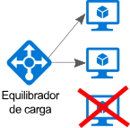
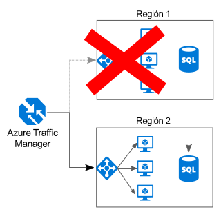

# Hacer que todo sea redundanteMake all things redundant

## Creación de redundancia en la aplicación, para evitar tener puntos únicos de errorBuild redundancy into your application, to avoid having single points of failure

Las aplicaciones resistentes esquivan los errores al enrutar.A resilient application routes around failure. Identifique las rutas críticas de la aplicación.Identify the critical paths in your application. ¿Hay redundancia en cada punto de la ruta de acceso?Is there redundancy at each point in the path? Si se produce un error en un subsistema, ¿conmutará por error la aplicación?If a subsystem fails, will the application fail over to something else?

## RecomendacionesRecommendations 

**Considere los requisitos empresariales**.**Consider business requirements**. La cantidad de redundancia integrada en un sistema puede afectar tanto al costo como a la complejidad.The amount of redundancy built into a system can affect both cost and complexity. La arquitectura debe recibir información de los requisitos empresariales, como el objetivo de tiempo de recuperación (RTO).Your architecture should be informed by your business requirements, such as recovery time objective (RTO). Por ejemplo, las implementaciones en varias regiones son más caras que las de una sola región y son más complicadas de administrar.For example, a multi-region deployment is more expensive than a single-region deployment, and is more complicated to manage. Necesitará procedimientos operativos para controlar la conmutación por error y la conmutación por recuperación.You will need operational procedures to handle failover and failback. El costo adicional y la complejidad podrían estar justificados para algunos escenarios empresariales pero no para otros.The additional cost and complexity might be justified for some business scenarios and not others.

**Coloque máquinas virtuales con un equilibrador de carga**.**Place VMs behind a load balancer**. No use una sola máquina virtual para las cargas de trabajo críticas.Don't use a single VM for mission-critical workloads. En su lugar, coloque varias máquinas virtuales con un equilibrador de carga.Instead, place multiple VMs behind a load balancer. Si alguna deja de estar disponible, el equilibrador de carga distribuye el tráfico a las demás máquinas virtuales en buen estado.If any VM becomes unavailable, the load balancer distributes traffic to the remaining healthy VMs. Para aprender a implementar esta configuración, consulte el artículo sobre la ejecución de [varias máquinas virtuales para conseguir escalabilidad y disponibilidad][multi-vm-blueprint].To learn how to deploy this configuration, see [Multiple VMs for scalability and availability][multi-vm-blueprint].

**Replique las bases de datos**.**Replicate databases**. Azure SQL Database y Cosmos DB replican automáticamente los datos dentro de una región y se puede habilitar la replicación geográfica de una región a otra.Azure SQL Database and Cosmos DB automatically replicate the data within a region, and you can enable geo-replication across regions. Si utiliza una solución de base de datos de IaaS, elija una que admita la replicación y la conmutación por error, como los [grupos de disponibilidad AlwaysOn (SQL Server)][sql-always-on].If you are using an IaaS database solution, choose one that supports replication and failover, such as [SQL Server Always On Availability Groups][sql-always-on]. 

**Habilite la replicación geográfica**.**Enable geo-replication**. La replicación geográfica para [Azure SQL Database][sql-geo-replication] y [Cosmos DB][cosmosdb-geo-replication] crea réplicas legibles secundarias de los datos en una o varias regiones secundarias.Geo-replication for [Azure SQL Database][sql-geo-replication] and [Cosmos DB][cosmosdb-geo-replication] creates secondary readable replicas of your data in one or more secondary regions. Si se produce una interrupción, la base de datos puede conmutar por error en la región secundaria para las operaciones de escritura.In the event of an outage, the database can fail over to the secondary region for writes.

**Cree particiones para conseguir disponibilidad**.**Partition for availability**. La creación de particiones de base de datos se suele usar para mejorar la escalabilidad, pero también puede mejorar la disponibilidad.Database partitioning is often used to improve scalability, but it can also improve availability. Aunque una partición deje de funcionar, puede acceder a las demás particiones.If one shard goes down, the other shards can still be reached. Un error en una partición solo provocará la interrupción en un subconjunto de transacciones.A failure in one shard will only disrupt a subset of the total transactions. 

**Realice implementaciones en más de una región**.**Deploy to more than one region**. Para la máxima disponibilidad, implemente la aplicación en más de una región.For the highest availability, deploy the application to more than one region. De este modo, en el caso excepcional de un problema que afecte a toda una región, la aplicación podrá conmutar por error a otra.That way, in the rare case when a problem affects an entire region, the application can fail over to another region. En el siguiente diagrama se muestra una aplicación en varias regiones que utiliza Azure Traffic Manager para controlar la conmutación por error.The following diagram shows a multi-region application that uses Azure Traffic Manager to handle failover.

**Sincronice la conmutación por error del front-end y del back-end**.**Synchronize front and backend failover**. Use Azure Traffic Manager para conmutar por error el front-end.Use Azure Traffic Manager to fail over the front end. Si el front-end está inaccesible en una región, Traffic Manager enruta las nuevas solicitudes a la región secundaria.If the front end becomes unreachable in one region, Traffic Manager will route new requests to the secondary region. Dependiendo de la solución de base de datos, puede que necesite coordinar la conmutación por error de la base de datos.Depending on your database solution, you may need to coordinate failing over the database. 

**Utilice la conmutación automática por error pero la conmutación por recuperación manual**.**Use automatic failover but manual failback**. Use Traffic Manager para la conmutación automática por error, pero no para la conmutación por recuperación automática.Use Traffic Manager for automatic failover, but not for automatic failback. La conmutación por recuperación automática supone el riesgo de cambiar a la región principal antes de que se encuentre totalmente en buen estado.Automatic failback carries a risk that you might switch to the primary region before the region is completely healthy. En su lugar, compruebe que todos los subsistemas de aplicación tengan un estado correcto antes de la conmutación por recuperación manual.Instead, verify that all application subsystems are healthy before manually failing back. Además, dependiendo de la base de datos, deberá comprobar la coherencia de los datos antes de la conmutación por recuperación.Also, depending on the database, you might need to check data consistency before failing back.

**Incluya redundancia para Traffic Manager**.**Include redundancy for Traffic Manager**. Traffic Manager es un posible punto de error.Traffic Manager is a possible failure point. Revise el Acuerdo de Nivel de Servicio de Traffic Manager y determine si el uso de Traffic Manager por sí solo cumple sus requisitos empresariales de alta disponibilidad.Review the Traffic Manager SLA, and determine whether using Traffic Manager alone meets your business requirements for high availability. Si no es así, considere la posibilidad de agregar otra solución de administración de tráfico como conmutación por recuperación.If not, consider adding another traffic management solution as a failback. Si el servicio Azure Traffic Manager no funciona, cambie los registros CNAME de DNS para que apunten a otro servicio de administración del tráfico.If the Azure Traffic Manager service fails, change your CNAME records in DNS to point to the other traffic management service.

<!-- links -->

[multi-vm-blueprint]: ../../reference-architectures/virtual-machines-windows/multi-vm.md

[cassandra]: https://cassandra.apache.org/
[cosmosdb-geo-replication]: /azure/cosmos-db/distribute-data-globally
[sql-always-on]: https://msdn.microsoft.com/library/hh510230.aspx
[sql-geo-replication]: /azure/sql-database/sql-database-geo-replication-overview
