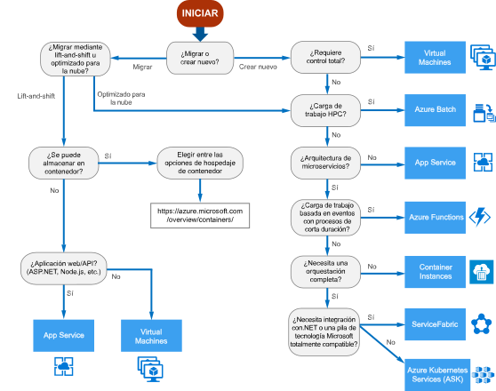

# Árbol de decisión para los servicios de proceso de AzureDecision tree for Azure compute services

Azure ofrece una serie de formas de hospedar el código de aplicación.Azure offers a number of ways to host your application code. El término *proceso* hace referencia al modelo de hospedaje para los recursos informáticos donde se ejecutan las aplicaciones.The term *compute* refers to the hosting model for the computing resources that your application runs on. El diagrama de flujo siguiente le ayudará a elegir un servicio de proceso para la aplicación.The following flowchart will help you to choose a compute service for your application. El diagrama de flujo le guía a través de un conjunto de criterios de decisión clave para alcanzar una recomendación.The flowchart guides you through a set of key decision criteria to reach a recommendation. 

**Tratar este diagrama de flujo como un punto de partida.****Treat this flowchart as a starting point.** Cada aplicación tiene requisitos únicos, por lo que debe usar la recomendación como un punto de partida.Every application has unique requirements, so use the recommendation as a starting point. A partir de ahí, realice una evaluación más detallada y examine aspectos como:Then perform a more detailed evaluation, looking at aspects such as:
 
- Conjunto de característicasFeature set
- [Límites de servicioService limits](/azure/azure-subscription-service-limits)
- [CosteeCost](https://azure.microsoft.com/pricing/)
- [Acuerdo de Nivel de ServicioSLA](https://azure.microsoft.com/support/legal/sla/)
- [Disponibilidad regionalRegional availability](https://azure.microsoft.com/global-infrastructure/services/)
- Ecosistema del desarrollador y habilidades del equipoDeveloper ecosystem and team skills
- [Tablas de comparación de procesosCompute comparison tables](./compute-comparison.md)

Si la aplicación consta de varias cargas de trabajo, evalúe cada carga de trabajo por separado.If your application consists of multiple workloads, evaluate each workload separately. Una solución completa puede incluir dos o más servicios de proceso.A complete solution may incorporate two or more compute services.

Para más información acerca de las opciones de hospedaje de contenedores en Azure, consulte https://azure.microsoft.com/overview/containers/.For more information about your options for hosting containers in Azure, see https://azure.microsoft.com/overview/containers/.

## Diagrama de flujoFlowchart

## DefinicionesDefinitions

- **Lift-and-shift** es una estrategia de migración de una carga de trabajo a la nube sin volver a diseñar la aplicación ni realizar cambios en el código.**Lift and shift** is a strategy for migrating a workload to the cloud without redesigning the application or making code changes. También se denomina *rehospedaje*.Also called *rehosting*. Para más información, consulte [Azure Migration Center](https://azure.microsoft.com/migration/).For more information, see [Azure migration center](https://azure.microsoft.com/migration/).

- **Optimizado para la nube** es una estrategia de migración a la nube mediante la refactorización de una aplicación para aprovechar las funcionalidades y características nativas de la nube.**Cloud optimized** is a strategy for migrating to the cloud by refactoring an application to take advantage of cloud-native features and capabilities.

## Pasos siguientesNext steps

Para que ver más criterios hay que tener en cuenta, consulte [Criterios para elegir un servicio de proceso de Azure](./compute-comparison.md).For additional criteria to consider, see [Criteria for choosing an Azure compute service](./compute-comparison.md).
