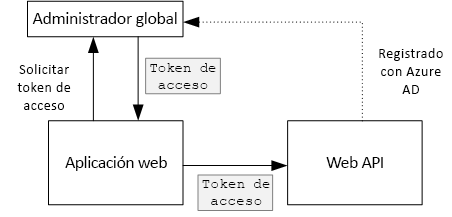
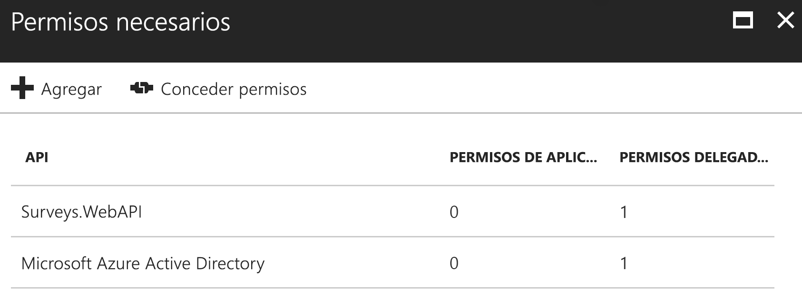

# <a name="secure-a-backend-web-api"></a>Protección de una API web de back-end

[ Código de ejemplo][sample application]

La aplicación [Tailspin Surveys] utiliza una API web de back-end web para administrar las operaciones CRUD en las encuestas. Por ejemplo, cuando un usuario hace clic en "My Surveys" (Mis encuestas), la aplicación web envía una solicitud HTTP a la API web:

```
GET /users/{userId}/surveys
```

La API web devuelve un objeto JSON:

```
{
  "Published":[],
  "Own":[
    {"Id":1,"Title":"Survey 1"},
    {"Id":3,"Title":"Survey 3"},
    ],
  "Contribute": [{"Id":8,"Title":"My survey"}]
}
```

La API web no permite solicitudes anónimas, por lo que la aplicación web debe autenticarse utilizando tokens de portador de OAuth 2.

> [!NOTE]
> Este es un escenario de servidor a servidor. La aplicación no realiza llamadas de AJAX a la API desde el explorador del cliente.
> 
> 

Puede basarse fundamentalmente en dos métodos:

* Identidad de usuario delegado. La aplicación web se autentica con la identidad del usuario.
* Identidad de aplicación. La aplicación web se autentica con su identificador de cliente, mediante el flujo de credenciales del cliente de OAuth2.

La aplicación Tailspin implementa la identidad de usuario delegado. Estas son la diferencias principales:

**Identidad de usuario delegado**

* El token de portador enviado a la API web contiene la identidad del usuario.
* La API web toma decisiones de autorización basadas en la identidad del usuario.
* La aplicación web necesita administrar errores 403 (Forbidden) desde la API web en caso de que el usuario no esté autorizado para realizar una acción.
* Normalmente, la aplicación web sigue tomando algunas decisiones de autorización que afectan a la IU, como el hecho de mostrar u ocultar los elementos de la IU.
* La API web la pueden usar por clientes que no sean de confianza, como una aplicación JavaScript o una aplicación cliente nativa.

**Identidad de la aplicación**

* La API web no obtiene información sobre el usuario.
* La API web no emite ninguna autorización basándose en la identidad del usuario. Todas las decisiones de autorización son adoptadas por la aplicación web.  
* La API web no puede utilizarse por un cliente que no sea de confianza (aplicación JavaScript o aplicación cliente nativa).
* Este planteamiento puede ser un poco más fácil de implementar, porque no hay ninguna lógica de autorización en la API web.

En cualquier planteamiento, la aplicación web debe obtener un token de acceso, que es la credencial necesaria para llamar a la API web.

* En el caso de la identidad de usuario delegado, el token tiene que provenir del proveedor de identidades, que puede emitir un token en nombre del usuario.
* En el caso de las credenciales de cliente, una aplicación puede obtener el token del IDP u hospedar su propio servidor de tokens (No escriba un servidor de tokens desde cero; utilice una plataforma probada como [IdentityServer4]). Si la autenticación se realiza con Azure AD, se recomienda encarecidamente obtener el token de acceso de Azure AD, incluso con el flujo de credenciales de cliente.

En el resto de este artículo se supone que la aplicación se autentica con Azure AD.



## <a name="register-the-web-api-in-azure-ad"></a>Registro de la API web en Azure AD
Para que Azure AD emita un token de portador para la API web, necesita hacer algunos ajustes en Azure AD.

1. Registre la API web en Azure AD.

2. Agregue el identificador de cliente de la aplicación web al manifiesto de la aplicación de API web, en la propiedad `knownClientApplications` . Consulte [Actualización de manifiestos de aplicaciones](Actualización de los manifiestos de la aplicación).

3. Conceda a la aplicación web permiso para llamar a la API web. En el Portal de administración de Azure, puede establecer dos tipos de permisos: "Permisos de aplicación" para la identidad de aplicación (flujo de credencial de cliente) o "Permisos delegados" para la identidad de usuario delegado.
   
   

## <a name="getting-an-access-token"></a>Obtención de un token de acceso
Antes de llamar a la API web, la aplicación web obtiene un token de acceso de Azure AD. En una aplicación. NET, use la [biblioteca de autenticación de Azure AD (ADAL) para .NET][ADAL].

En el flujo de código de autorización de OAuth 2, la aplicación intercambia un código de autorización para un token de acceso. El código siguiente usa ADAL para obtener el token de acceso. A este código se le llama durante los eventos `AuthorizationCodeReceived` .

```csharp
// The OpenID Connect middleware sends this event when it gets the authorization code.   
public override async Task AuthorizationCodeReceived(AuthorizationCodeReceivedContext context)
{
    string authorizationCode = context.ProtocolMessage.Code;
    string authority = "https://login.microsoftonline.com/" + tenantID
    string resourceID = "https://tailspin.onmicrosoft.com/surveys.webapi" // App ID URI
    ClientCredential credential = new ClientCredential(clientId, clientSecret);

    AuthenticationContext authContext = new AuthenticationContext(authority, tokenCache);
    AuthenticationResult authResult = await authContext.AcquireTokenByAuthorizationCodeAsync(
        authorizationCode, new Uri(redirectUri), credential, resourceID);

    // If successful, the token is in authResult.AccessToken
}
```

Estos son los distintos parámetros que son necesarios:

* `authority`. Se deriva del identificador del inquilino del usuario que ha iniciado sesión (no el identificador del inquilino del proveedor de SaaS.)  
* `authorizationCode`. El código de autenticación que obtuvo del proveedor de identidades.
* `clientId`. El identificador de cliente de la aplicación web.
* `clientSecret`. El secreto de cliente de la aplicación web.
* `redirectUri`. El URI de redirección establecido para OpenID Connect. Es aquí donde se llama de nuevo al proveedor de identidades con el token.
* `resourceID`. El URI del identificador de aplicación de la API web que creó cuando registró la API web en Azure AD.
* `tokenCache`. Un objeto que almacena en caché los tokens de acceso. Consulte [Almacenamiento en caché de tokens](Almacenamiento en caché de tokens).

Si `AcquireTokenByAuthorizationCodeAsync` se completa correctamente, ADAL almacena en caché el token. Más adelante, puede obtener el token de la memoria caché mediante una llamada a AcquireTokenSilentAsync:

```csharp
AuthenticationContext authContext = new AuthenticationContext(authority, tokenCache);
var result = await authContext.AcquireTokenSilentAsync(resourceID, credential, new UserIdentifier(userId, UserIdentifierType.UniqueId));
```

donde `userId` es el identificador de objeto del usuario, que se encuentra en la notificación `http://schemas.microsoft.com/identity/claims/objectidentifier`.

## <a name="using-the-access-token-to-call-the-web-api"></a>Uso del token de acceso para llamar a la API web
Una vez que tenga el token, envíelo en el encabezado de autorización de las solicitudes HTTP a la API web.

```
Authorization: Bearer xxxxxxxxxx
```

El siguiente método de extensión de la aplicación Surveys establece el encabezado de autorización en un HTTP de solicitud, utilizando para ello la clase **HttpClient** .

```csharp
public static async Task<HttpResponseMessage> SendRequestWithBearerTokenAsync(this HttpClient httpClient, HttpMethod method, string path, object requestBody, string accessToken, CancellationToken ct)
{
    var request = new HttpRequestMessage(method, path);
    if (requestBody != null)
    {
        var json = JsonConvert.SerializeObject(requestBody, Formatting.None);
        var content = new StringContent(json, Encoding.UTF8, "application/json");
        request.Content = content;
    }

    request.Headers.Authorization = new AuthenticationHeaderValue("Bearer", accessToken);
    request.Headers.Accept.Add(new MediaTypeWithQualityHeaderValue("application/json"));

    var response = await httpClient.SendAsync(request, ct);
    return response;
}
```

## <a name="authenticating-in-the-web-api"></a>Autenticación en la API web
La API web tiene que autenticar el token de portador. En ASP.NET Core, se puede usar el paquete [Microsoft.AspNet.Authentication.JwtBearer] [ JwtBearer]. Este paquete proporciona software intermedio que permite a la aplicación recibir los tokens de portador de OpenID Connect.

Registre el software intermedio en la clase `Startup` de la API web.

```csharp
public void Configure(IApplicationBuilder app, IHostingEnvironment env, ApplicationDbContext dbContext, ILoggerFactory loggerFactory)
{
    // ...

    app.UseJwtBearerAuthentication(new JwtBearerOptions {
        Audience = configOptions.AzureAd.WebApiResourceId,
        Authority = Constants.AuthEndpointPrefix,
        TokenValidationParameters = new TokenValidationParameters {
            ValidateIssuer = false
        },
        Events= new SurveysJwtBearerEvents(loggerFactory.CreateLogger<SurveysJwtBearerEvents>())
    });
    
    // ...
}
```

* **Audience**. Establezca este valor en la dirección URL del identificador de la aplicación para la API web, que creó al registrar la API web en Azure AD.
* **Authority**. Para una aplicación multiinquilino, establezca esta propiedad en `https://login.microsoftonline.com/common/`.
* **TokenValidationParameters**. Para una aplicación multiinquilino, establezca **ValidateIssuer** en false. Esto significa que la aplicación validará al emisor.
* **Events** es una clase que deriva de **JwtBearerEvents**.

### <a name="issuer-validation"></a>Validación del emisor
Valide el emisor del token en el evento **JwtBearerEvents.TokenValidated**. El emisor se envía en la notificación "iss".

En la aplicación Surveys, la API web no controla el [registro de inquilinos]. Por lo tanto, solo comprueba si el emisor ya está en la base de datos de la aplicación. Si no es así, se produce una excepción, lo que provoca un error de autenticación.

```csharp
public override async Task TokenValidated(TokenValidatedContext context)
{
    var principal = context.Ticket.Principal;
    var tenantManager = context.HttpContext.RequestServices.GetService<TenantManager>();
    var userManager = context.HttpContext.RequestServices.GetService<UserManager>();
    var issuerValue = principal.GetIssuerValue();
    var tenant = await tenantManager.FindByIssuerValueAsync(issuerValue);

    if (tenant == null)
    {
        // The caller was not from a trusted issuer. Throw to block the authentication flow.
        throw new SecurityTokenValidationException();
    }

    var identity = principal.Identities.First();

    // Add new claim for survey_userid
    var registeredUser = await userManager.FindByObjectIdentifier(principal.GetObjectIdentifierValue());
    identity.AddClaim(new Claim(SurveyClaimTypes.SurveyUserIdClaimType, registeredUser.Id.ToString()));
    identity.AddClaim(new Claim(SurveyClaimTypes.SurveyTenantIdClaimType, registeredUser.TenantId.ToString()));

    // Add new claim for Email
    var email = principal.FindFirst(ClaimTypes.Upn)?.Value;
    if (!string.IsNullOrWhiteSpace(email))
    {
        identity.AddClaim(new Claim(ClaimTypes.Email, email));
    }
}
```

Como se muestra en este ejemplo, también se puede usar el evento **TokenValidated** para modificar las notificaciones. Recuerde que las notificaciones proceden directamente de Azure AD. Si la aplicación web modifica las notificaciones que obtiene, dichos cambios no se mostrarán en el token de portador que recibe la API web. Para más información, consulte [Claims transformations][claims-transformation] (Transformaciones de las notificaciones).

## <a name="authorization"></a>Autorización
Para un análisis general sobre la autorización, consulte [Role-based and resource-based authorization][Authorization] (Autorización basada en roles y basada en recursos). 

El middleware JwtBearer controla las respuestas de la autorización. Por ejemplo, para restringir una acción del controlador a los usuarios autenticados, utilice el atributo **[Authorize]** y especifique **JwtBearerDefaults.AuthenticationScheme** como esquema de autenticación:

```csharp
[Authorize(ActiveAuthenticationSchemes = JwtBearerDefaults.AuthenticationScheme)]
```

Esto devuelve un código de estado 401 si el usuario no está autenticado.

Para restringir una acción del controlador por directiva de autorización, especifique el nombre de la directiva en el atributo **[Authorize]**:

```csharp
[Authorize(Policy = PolicyNames.RequireSurveyCreator)]
```

Esto devuelve un código de estado 401 si el usuario no está autenticado, y 403 si el usuario está autenticado pero no autorizado. Registre la directiva en el inicio:

```csharp
public void ConfigureServices(IServiceCollection services)
{
    services.AddAuthorization(options =>
    {
        options.AddPolicy(PolicyNames.RequireSurveyCreator,
            policy =>
            {
                policy.AddRequirements(new SurveyCreatorRequirement());
                policy.RequireAuthenticatedUser(); // Adds DenyAnonymousAuthorizationRequirement 
                policy.AddAuthenticationSchemes(JwtBearerDefaults.AuthenticationScheme);
            });
        options.AddPolicy(PolicyNames.RequireSurveyAdmin,
            policy =>
            {
                policy.AddRequirements(new SurveyAdminRequirement());
                policy.RequireAuthenticatedUser(); // Adds DenyAnonymousAuthorizationRequirement 
                policy.AddAuthenticationSchemes(JwtBearerDefaults.AuthenticationScheme);
            });
    });
    
    // ...
}
```

[**Siguiente**][token cache]

<!-- links -->
[ADAL]: https://msdn.microsoft.com/library/azure/jj573266.aspx
[JwtBearer]: https://www.nuget.org/packages/Microsoft.AspNet.Authentication.JwtBearer

[Tailspin Surveys]: tailspin.md
[IdentityServer4]: https://github.com/IdentityServer/IdentityServer4
[Actualización de manifiestos de aplicaciones]: ./run-the-app.md#update-the-application-manifests
[Almacenamiento en caché de tokens]: token-cache.md
[registro de inquilinos]: signup.md
[claims-transformation]: claims.md#claims-transformations
[Authorization]: authorize.md
[sample application]: https://github.com/mspnp/multitenant-saas-guidance
[token cache]: token-cache.md
